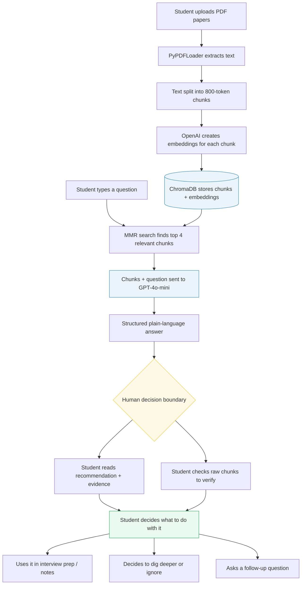
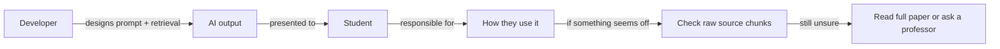

# Research Paper Explainer

> A RAG tool for making sense of dense academic papers, built for students, job seekers, and early-career professionals who need to understand research quickly.

---

## 1. System Description

### The Problem

Honestly, the idea for this came from a realistic potential frustration. In a circumstance where a job interview is coming up for a consumer insights role at a retail company, I would want to prepare the best I could by being able to talk about behavioral economics and shopper psychology. So, I want to be able to understand academic papers on things like consumer decision-making, stuff about choice overload, anchoring effects, and in-store nudge strategies. The problem was that the papers were very unreadable to me. Abstract jargon, lots of pages, statistical tables I didn't know how to interpret. I could skim them, but I couldn't actually extract the "so what" in a way I could talk about confidently in an interview.

That's what this tool is trying to solve. The Research Paper Explainer lets you upload academic PDFs and ask questions about them in plain English. It pulls the most relevant parts of the paper and explains the findings in a way a non-expert can actually use. The target user is someone like me: a student, job seeker, or early-career professional who needs to understand research quickly without having a PhD in the field.

### What the AI Does

The system uses a retrieval-augmented generation (RAG) approach. In simple terms:

- It breaks uploaded PDFs into smaller chunks of text
- When you ask a question, it finds the chunks most relevant to your question
- It passes those chunks to a language model (GPT-4o-mini) along with a prompt that says: *explain this like the reader has no background in this field*
- The answer comes back structured into: a recommendation, the evidence behind it, tradeoffs/limitations, a confidence level, and an override path if you disagree

### What Decision the Human Makes

After reading the AI's output, the user decides:

- Whether the summary actually reflects what the paper is saying (you can verify this by checking the raw retrieved chunks the app shows you)
- What to do with the information. You can use it in an interview answer, flag it as needing more research, or just discard it

The system is explicitly not making any real-world recommendation on its own. It's more like a study buddy that has read the paper faster than you did.

### Who Is Accountable

This is important to spell out because it's easy to forget when a tool gives you a confident-sounding answer:

| Who | What they control | Accountable for |
|---|---|---|
| The user (me, a student) | Which papers to upload, what questions to ask, what to do with the output | Any decisions or statements made based on the AI's summaries |
| The developer (also me) | Prompt wording, chunk size, how retrieval works | Whether the AI gives answers that are honest about their limits |
| OpenAI / GPT-4o-mini | Generating language from the retrieved text | Any hallucinated details not grounded in the actual chunks |
| The original paper authors | The underlying research quality | Validity of the findings being summarized |

---

## 2. Architecture Diagram

Here's how the system fits together. I've tried to show where the AI stops and where the human takes over, which I think is a very important part from a systems thinking perspective.



The yellow box is the decision boundary: where the AI's job ends and the student's judgment takes over. The blue boxes are AI components. The green box is where the human is fully in control.

**Accountability flow:**



---

## 3. Working Prototype

The prototype is a Streamlit app. It's not perfect but it works end-to-end and demonstrates the full decision flow.

### How to run it

Install dependencies:

```bash
pip install streamlit langchain langchain-openai langchain-community chromadb pypdf python-dotenv
```

Add your OpenAI key to a `.env` file:

```
OPENAI_API_KEY=your-key-here
```

Run the app:

```bash
streamlit run app.py
```

### What it does

- **Sidebar:** upload one or more PDFs, click "Ingest papers". This chunks the text and builds a local vector database
- **Main area:** type a question, click "Get answer"
- The app retrieves the 4 most relevant chunks using max marginal relevance (MMR), which helps avoid getting 4 chunks that all say the same thing
- GPT-4o-mini generates a structured answer: recommendation, evidence, tradeoffs, confidence, and what to do if you disagree
- Below the answer, there's an expandable section showing the exact text chunks that were used, so you can fact-check the AI against the actual paper

---

## 4. Decision Walkthrough

### Scenario: Interview prep for a consumer insights role

Here's the situation I had in mind when building this. I had a first-round interview for a consumer insights analyst position at a mid-size retail company. In the job description they specifically mentioned "behavioral economics" and "customer decision-making frameworks." I found a well-cited academic paper on choice overload in retail environments about 21 pages dense with jargon, and uploaded it to the app.

**My question:**

> *"What does this paper say about how too many product options affect what customers buy, and is there anything I could actually mention in a job interview?"*

### What the AI returned

**Key Takeaway**
The paper investigates *Decision Paralysis*, which is when consumers face too many choices and struggle to make a selection. It highlights that Choice Overload can negatively impact psychological well-being and post-purchase satisfaction.

**Recommendation**
Businesses should consider providing a smaller set of options. This can lead to better decision-making and higher satisfaction levels post-purchase.

**Evidence**
- Consumers frequently default to familiar products when presented with many options (Le Lec et al., 2016)
- Individuals struggle to decide with larger choice sets (Alvarez et al., 2014)
- Smaller selections lead to greater post-purchase satisfaction (Grandi & Cardinali, 2020)

**Tradeoffs / Limitations**
While fewer options can enhance satisfaction, it may limit consumers' ability to find a product that perfectly meets their needs, and could reduce market potential for firms with diverse product lines.

**Confidence and Uncertainty**
Moderately confident based on the collected evidence, but there may be additional factors affecting consumer behavior not covered in this study.

**Appeal or Override Path**
If you disagree, consider discussing the value of comprehensive options tailored to specific consumer needs, and how consumer education around available choices can aid decision-making.

**Job Interview Use**
Highlight that research shows fewer options can enhance satisfaction and decision-making, potentially leading to better sales outcomes and customer loyalty. This demonstrates awareness of consumer behavior and its practical implications for product strategy.

### Human interpretation

I clicked open the retrieved chunks to double-check the study figures, and it looked accurate. It doesn't look the prettiest, but the AI got me 80% of the way there in a very short amount of time, and I did the remaining 20% verification myself.

### The final decision

If I were in an interview, I would use the choice overload finding as a talking point but frame it carefully as "research suggests" rather than "it's proven that." The AI's appeal path section actually prompted me to think deeper about that, which I probably wouldn't have done on my own.

### The appeal / override path

If something in the AI's summary had seemed off, like a number that felt too precise or a claim that didn't match what I half-remembered from skimming the paper, the retrieved chunks expander lets me go straight to the source text. From there, I can either verify it or flag it as something not to use.

---

## 5. Reflection

### Where does the system intentionally stop?

The system stops at explanation. It will not tell me whether the paper's research design is methodologically sound, whether the journal it was published in is reputable, or whether the findings have held up in later research. It only works with what's in the uploaded PDF.

That's a deliberate choice. I could have tried to make it search the web or cross-reference citations, but that would make the accountability question much harder. As it is, if the AI gets something wrong, I can trace it back to a specific chunk of text. If it were pulling from 10 different sources dynamically, that transparency would be a lot harder.

The other intentional stopping point is that it doesn't tell me what to do. It gives me a recommendation based on the paper, but the "should I actually say this in my interview" question is mine to answer.

### What risks remain?

- **Chunking can cut context badly:** if a key caveat appears right before or after a chunk boundary, the AI might miss it entirely and give a more confident answer than the paper warrants
- **The AI sounds confident even when it shouldn't:** even with the confidence level field in the prompt, LLM tends to produce fluent, authoritative-sounding text, a user who doesn't read carefully might miss uncertainty signals
- **No paper quality filter:** I could upload a bad paper, a retracted study, or even a blog post saved as a PDF, and the system would treat it the same way. The output is only as good as what I upload
- **Interview-specific risk:** if I repeated an AI-generated summary in an interview without fully understanding it and the interviewer asked a follow-up I couldn't answer, that would be worse than not knowing the paper at all. The tool is a starting point, not a substitute for understanding

### How could misuse occur?

- Someone uploads only papers that support one side of an argument, generates a summary, and presents it as "research shows" without disclosing the selection
- In a higher-stakes context than interview prep, say, a policy recommendation or business decision, someone treats the AI output as sufficient due diligence when it isn't
- The structured format (Recommendation / Evidence / Confidence) might look more rigorous than it is. It's easy to mistake formatting for expertise

### What would governance look like at scale?

If this became a tool used across a company or institution, I'd want a few things in place:

- **Required disclosure:** users acknowledge the output is a starting point, not a final source, before exporting or sharing an answer
- **Source logging:** keep a record of which PDFs were uploaded and what questions were asked, so there's an audit trail if someone misrepresents what the research says
- **Forced transparency:** the retrieved chunks section should be shown by default, not hidden behind an expander, so users always see what the AI is working from
- **Domain escalation warnings:** for anything beyond low-stakes use (interview prep, coursework, general curiosity), a clear message should recommend expert review before acting on the findings

For the scale of this class project, none of that is implemented. But I think being honest about where the guardrails are is important.
