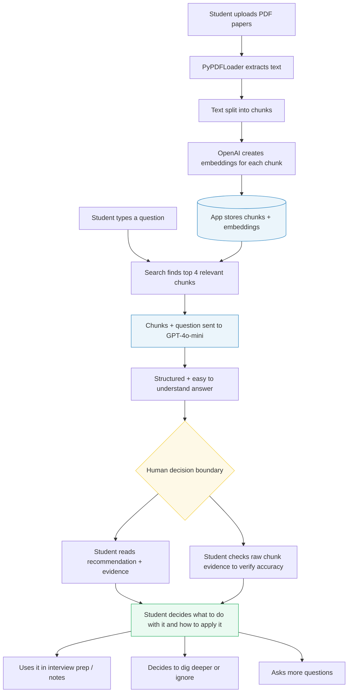
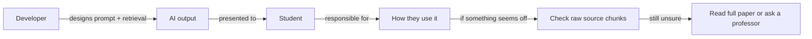

# Research Paper Explainer

> A RAG tool for making sense of dense academic papers, built for students, job seekers, and early-career professionals who need to understand research quickly.

---

## 1. System Description

### The Problem

Honestly, the idea for this came from a realistic potential frustration. In a circumstance where a job interview is coming up, for example for a consumer insights role, I would want to prepare the best I could by being able to talk about topics such as shopper psychology. So, I woudl weant to do my reserach and be able to understand the relevant academic papers. The problem is that a lot of the academic papers/jounals are quite unreadable to me. There is a lot of experimental design jargon I dont understand spread over many pages, not to mention the statistical tables I don't know how to interpret. I could skim them, but I couldn't actually understand the "so what" in a way which I could talk about confidently in an interview.

That's the goal of this tool. This Research RAG lets you upload academic PDFs and ask questions about them in a way one can understand without having a PHD in the field. This could be useful for any job seeker out there.

### What the AI Does/Recommends

The system uses retrieval-augmented generation (RAG). This means it:

- Breaks uploaded PDFs into chunks of text the AI can interpret semantically
- When you ask a question, it finds the chunks most relevant to your question
- It passes those chunks to a language model (GPT-4o-mini) along with a prompt that says: *explain this like the reader has no background in this field*
- The answer comes back structured into: a recommendation, the evidence behind it, tradeoffs/limitations, a confidence level, and an override path if you disagree

### What Decision the Human Makes

After reading the AI's output, the user decides:

- Whether the summary actually reflects what the paper is saying (you can verify this by checking the chunks pulled from the text shown below the response)
- What to do with the information, and the further thinking about how this could be applied to the specific company/industry they are interviewing for.


### Who Is Accountable

| Who | What they control | Accountable for |
|---|---|---|
| The user (me, a student) | Which papers to upload, what questions to ask, what to do with the output | Any assumptions or statements made based on the AI's summaries |
| The developer (also me) | Prompt wording, chunk size, how retrieval works | Whether the AI gives answers that are accurate|
| OpenAI / GPT-4o-mini | Generating language from the retrieved text | Any hallucinated details not grounded in the actual chunks |
| The original paper authors | The underlying research quality | Validity/accuracy of the findings being summarized |

---

## 2. Architecture Diagram

Here's the breakdown of the system's relationships, including where the AI stops and where the human takes over.



The yellow box is the decision boundary: where the AI's job ends and the student's judgment begins. The blue boxes are AI components. The green box is where the human is fully in control.

**Accountability flow:**



---

## 3. Working Prototype

The prototype uses a Streamlit app. It's not perfect, and is VERY vibe-coded, but it works!

### How to run it

Install dependencies:

```bash
pip install streamlit langchain langchain-openai langchain-community chromadb pypdf python-dotenv
```

Add your OpenAI key to a `.env` file:

```
OPENAI_API_KEY=your-key-here
```

Run the app:

```bash
streamlit run app.py
```

### What it does

- **Sidebar:** upload one or more PDFs, click "Ingest papers". This chunks the text and builds a vector database
- **Main area:** type a question, click "Get answer"
- The app retrieves the 4 most relevant chunks, with the back-end code ensuring that the chunks don't repeat
- GPT-4o-mini generates a structured answer: recommendation, evidence, tradeoffs, confidence, and what to do if you disagree
- Below the answer, there's an expandable section that shows the exact text chunks that were used, so you can fact-check against the actual paper

---

## 4. Decision Walkthrough

### Scenario: Interview prep for a consumer insights role

Here's the situation I had in mind when building this. As stated in the begining, I have a first-round interview for a consumer insights analyst position. In the job description they specifically mentioned "customer decision-making frameworks", of which I feel like I should do some more reserach on to fully understand. I find some well-cited academic papers on choice overload, about 21 pages dense with jargon, and upload it to the app!

**My question:**

> *"What does this paper say about how too many product options affect what customers buy, and is there anything I could actually mention in a job interview?"*

### What the AI returned

**Key Takeaway**
The paper investigates *Decision Paralysis*, which is when consumers face too many choices and struggle to make a selection. It highlights that Choice Overload can negatively impact psychological well-being and post-purchase satisfaction.

**Recommendation**
Businesses should consider providing a smaller set of options. This can lead to better decision-making and higher satisfaction levels post-purchase.

**Evidence**
- Consumers frequently default to familiar products when presented with many options (Le Lec et al., 2016)
- Individuals struggle to decide with larger choice sets (Alvarez et al., 2014)
- Smaller selections lead to greater post-purchase satisfaction (Grandi & Cardinali, 2020)

**Tradeoffs / Limitations**
While fewer options can enhance satisfaction, it may limit consumers' ability to find a product that perfectly meets their needs, and could reduce market potential for firms with diverse product lines.

**Confidence and Uncertainty**
Moderately confident based on the collected evidence, but there may be additional factors affecting consumer behavior not covered in this study.

**Appeal or Override Path**
If you disagree, consider discussing the value of comprehensive options tailored to specific consumer needs, and how consumer education around available choices can aid decision-making.

**Job Interview Use**
Highlight that research shows fewer options can enhance satisfaction and decision-making, potentially leading to better sales outcomes and customer loyalty. This demonstrates awareness of consumer behavior and its practical implications for product strategy.

### Human interpretation

I clicked open the raw chunks section to double-check the study figures, and it looked accurate. It doesn't look the prettiest, but the AI got me 80% of the way there in a very short amount of time, and I did the remaining 20% verification by skimming the paper.

### The final decision

If I were in an interview, I would use the findingd as a talking point, but make sure to frame it carefully as "according to this research" rather than "it's proven that." I would overall want this to a supplement to my interview, show that I did my research, and spark a deeper conversation with the interviewer.

### The appeal / override path

If something in the AI's summary had seemed off or inaccurate, like a claim that didn't match what I half-remembered from skimming the paper, the retrieved chunks section would let me go straight to the retwived text. I would also want to amke sure that the chunks reciever lines up with the paper itself, especially if I would be using direct numbers. Maybe even pull in several documents to cross-compare in the same way.

---

## 5. Reflection

### Where does the system intentionally stop?

The system intentially stops at the explanation step. It will not tell me whether the paper's research design or methods is sound, whether it's credible, or compare the findings to later research. It only works with what's in the uploaded PDF, which comes with risks. It's up to me to make sure the data that I am feeding my RAG is good.

If the AI gets something wrong, I like that I can trace it back to a specific chunk of text, but I have to be the one to make sure the text itself isn't wrong.

Another stopping point is that the RAG doesn't tell me what to do. It gives me a recommendation based on the paper, and some ideas to apply it to the interview, but I am the one to dive deeper into the "so what".

### What risks remain?

- **The AI sounds confident even when it shouldn't:** even with the confidence level section in the back-end code of the prompt, LLMs tends to produce fluent, authoritative-sounding text, which can be interpreted by a user as something to fully trust. Instead, double/cross-checking is important especially in a high-stakes employment opportunity.
- **No paper quality filter:** I could upload a bad paper or even a blog post saved as a PDF, and the system would treat it the same way. The output is only as good as what I input.
- **Interview-specific risk:** There is a risk of repeating an AI-generated summary in an interview without fully understanding it, or it being wrong, and the interviewer asked a follow-up I can't answer. It is up to me to have the AI output be a part of my research, not the whole thing. I would be caustous about not using this tool as a substitute for understanding the concepts.

### How could misuse occur?

- User uploads only papers that support one side of an argument, generates a bias summary and sells it as "reserach proves"
- In a higher-stakes context than interview prep, someone treats the AI output as sufficient research

### What would governance look like at scale?

If this became a tool used across a temp company or school, I think governance at scale would look like this:

- **Required disclosure:** users acknowledge the output is a starting point before more research/double checking, before stating an answer
- **Source Records:** keep a record of which PDFs were uploaded and what questions were asked, so there's a trail if someone misrepresents what the research says
- **Cleaner Evidence:** I would want to clean up the evidence section and go through more rigiourous testing to make sure the chunks are accurate and the LLM is pulling a reasonable answer from them

