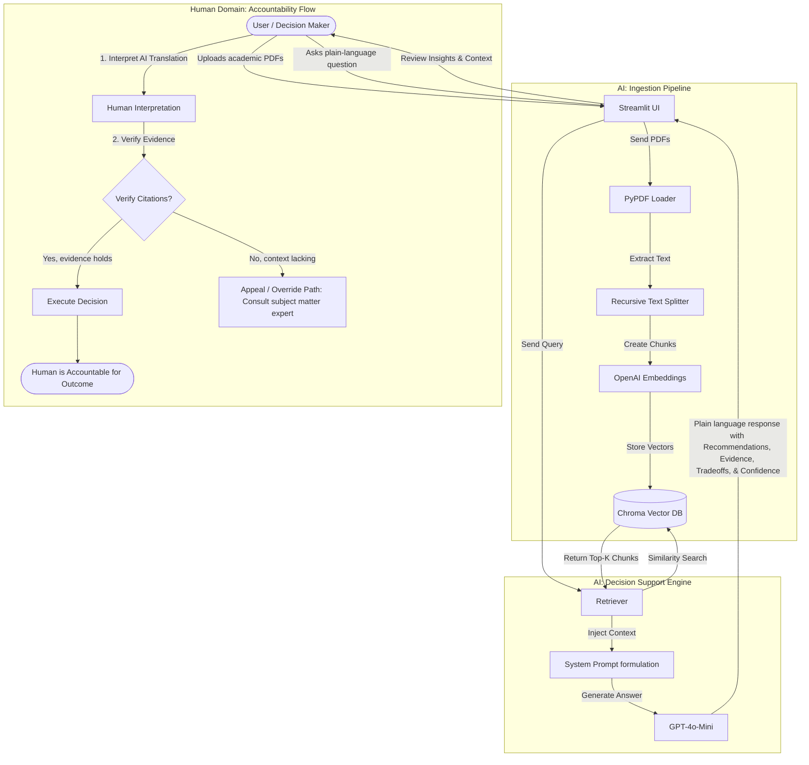

# Research Paper Explainer RAG System

## 1. System Description

**The Problem Your System Addresses:**
Academic research is often locked behind dense, complex experimental jargon, making it difficult for decision-makers, policymakers, and non-expert practitioners to extract actionable insights. This barrier slows down strategic decision-making and limits the widespread application of valuable research.

**What the AI Predicts or Recommends:**
The AI acts as a "research translator." By using a Retrieval-Augmented Generation (RAG) pipeline over uploaded academic PDFs, it extracts relevant findings based on a user's question and synthesizes them into plain-language recommendations. It explicitly provides evidence (citations to the text), states tradeoffs, and assigns a confidence level based on the context available.

**What Decision Humans Make:**
The human uses the AI's synthesized insights to inform strategic, policy, or business decisions. The human must weigh the AI's interpretation against external context, verify the cited evidence if the decision is high-stakes, and ultimately choose whether to adopt, adapt, or reject the AI's recommendation. 

**Who is Accountable for Outcomes:**
The human decision-maker retains full accountability for any outcomes resulting from their choices. The AI is positioned strictly as a decision-support tool—a sophisticated search and summarization engine—not an autonomous decision-maker.

---

## 2. Architecture Diagram

---

## 3. Working Prototype (Code)

A working prototype has been implemented in this repository.
- **`app.py`**: The main Streamlit web interface demonstrating the upload → ingest → RAG Q&A loop.
- **Ingestion**: Uses `PyPDFLoader`, `RecursiveCharacterTextSplitter`, and `Chroma`.
- **LLM**: Uses `gpt-4o-mini` via LangChain.
- **Constraints**: Custom prompt engineering strictly enforces non-technical jargon, recommendations, and confidence/tradeoffs styling.

*(Run `python -m streamlit run app.py` to start the local UI).*

---

## 4. Decision Walkthrough

**Scenario:** A local health department director is trying to decide whether to implement a new community mask mandate based on recent studies on mask efficacy against a new respiratory variant.

- **AI Input (User):** The director uploads three complex epidemiological PDFs and asks, *"Should we mandate masks based on these new studies?"*
- **AI Output:**
  - **Recommendation:** Implement a targeted mask recommendation in high-density indoor areas, rather than a universal mandate.
  - **Evidence:** Chunk 2 (Smith et al. 2024) indicates a 40% reduction in transmission in unventilated indoor spaces, but negligible differences outdoors. 
  - **Tradeoffs:** Universal mandates cause higher community fatigue and non-compliance (Chunk 4), reducing overall effectiveness.
  - **Confidence:** High confidence regarding the indoor data; low confidence regarding long-term mandates.
- **Human Interpretation:** The director reads the insights, expands the "Retrieved Context" UI to see the exact text from Smith et al., and agrees with the tradeoff assessment regarding fatigue.
- **Final Decision:** The director decides to issue an *advisory* for indoor high-density spaces, rather than a legal mandate.
- **Appeal or Override Path:** If a city council member disagrees with the advisory, their override path is to request a formal review of the original PDFs by the department's resident epidemiologist, bypassing the AI's translation layer.

---

## 5. Reflection

**Where does your system intentionally stop?**
The system intentionally stops at *translation and recommendation*. It will not make the final call, and it is explicitly instructed to "honestly say so" if the retrieved context does not contain enough information to formulate a recommendation. It presents the raw chunks alongside its answer to encourage the user to verify its work.

**What risks remain?**
- **Hallucination over jargon:** The LLM might misinterpret a highly specialized experimental term when trying to translate it into plain language, leading to an incorrect summary.
- **Limited Context Window:** If a paper's conclusion is spread across a 50-page document, the `k=4` retrieval strategy might miss vital nuance, serving up an incomplete picture to the decision-maker.

**How could misuse occur?**
A user could experience "automation bias," treating the AI's translation as undeniable fact. Instead of using the tool to *support* their decision, a lazy administrator might blindly copy-paste the AI's "Recommendation" section into a policy document without manually verifying the cited chunks or considering external, un-uploaded variables.

**What would governance look like at scale?**
At an enterprise or government scale, governance would require:
1. **Curated Databanks (Allow-lists):** Users could only query pre-vetted, peer-reviewed PDFs ingested centrally, rather than uploading random papers from the internet.
2. **Audit Trails:** Every query and resulting AI recommendation would be logged alongside the human's final decision. If a bad decision is made, auditors can review whether the human blindly followed bad AI advice or ignored good AI advice.
3. **Mandatory Human-in-the-Loop:** Policy decisions generated by the tool would require digital sign-off from two separate human supervisors, reinforcing the system's role as a support tool rather than an oracle.
